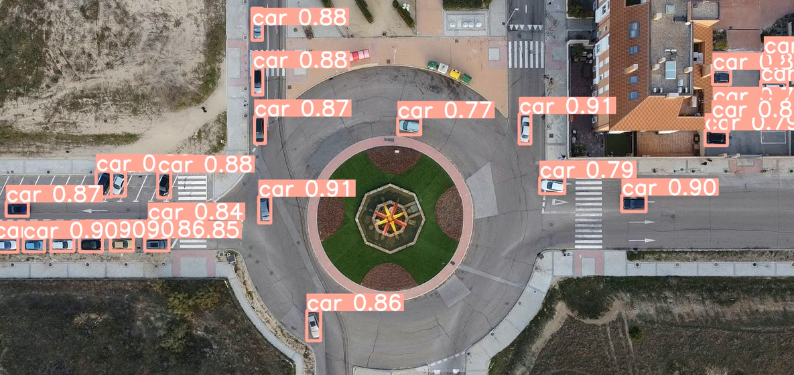
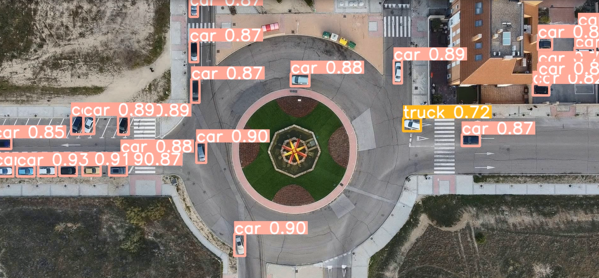
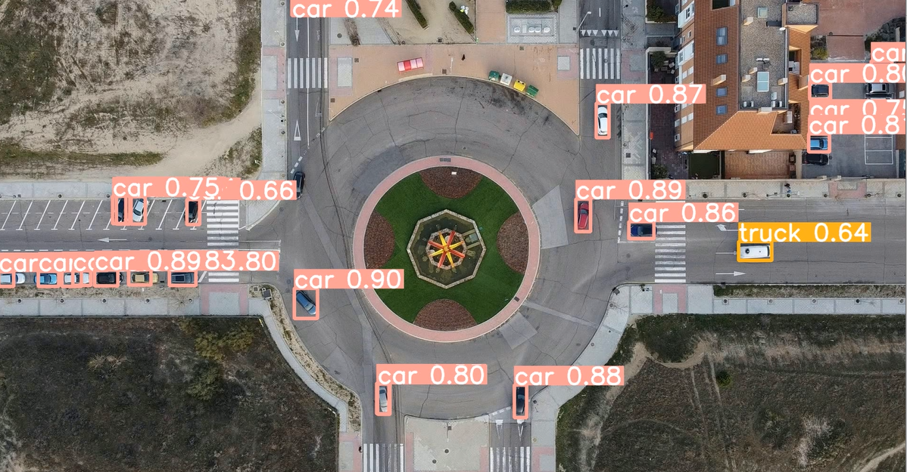
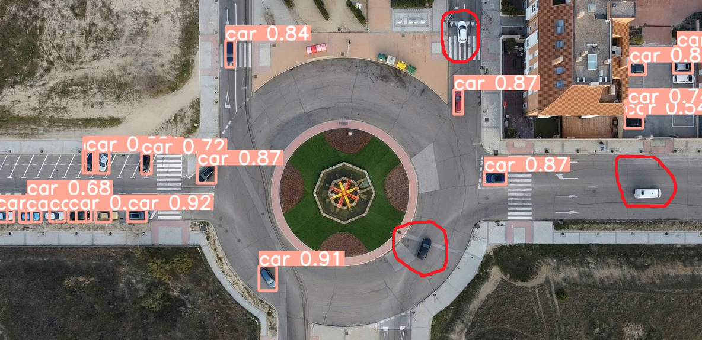
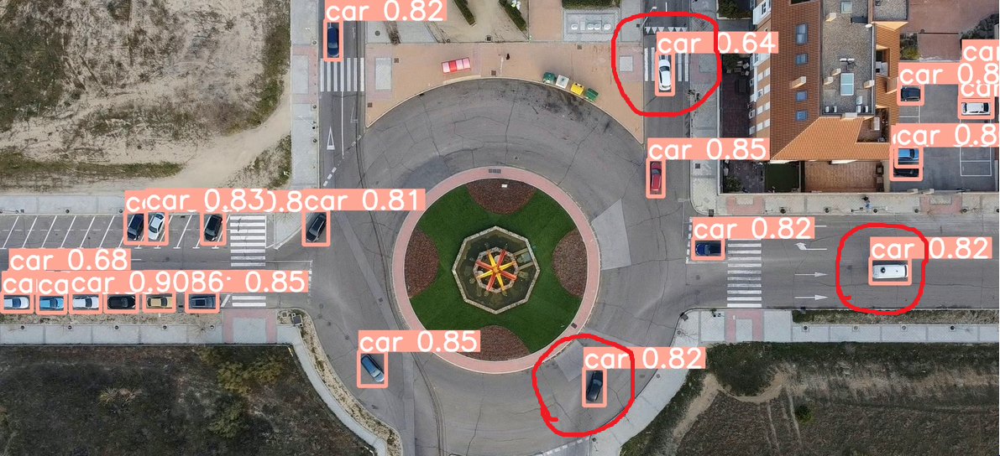
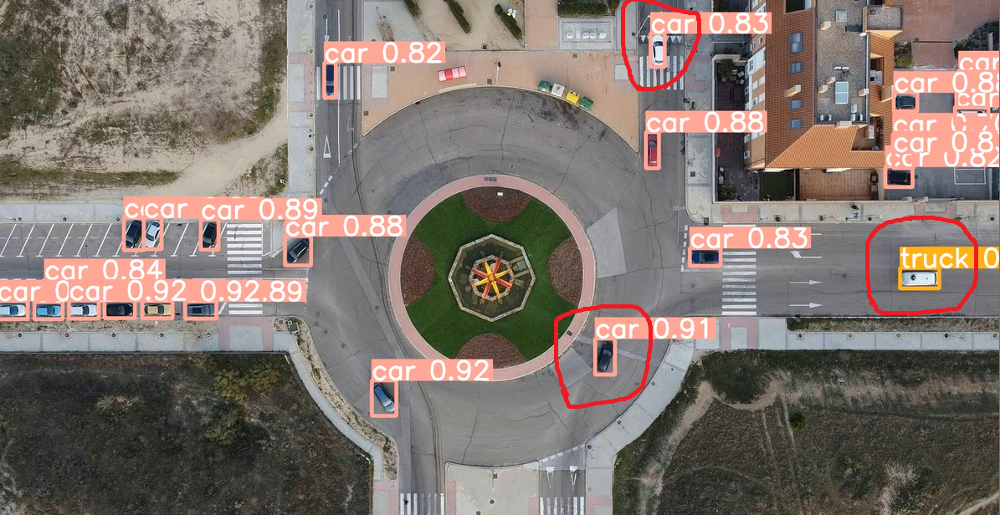
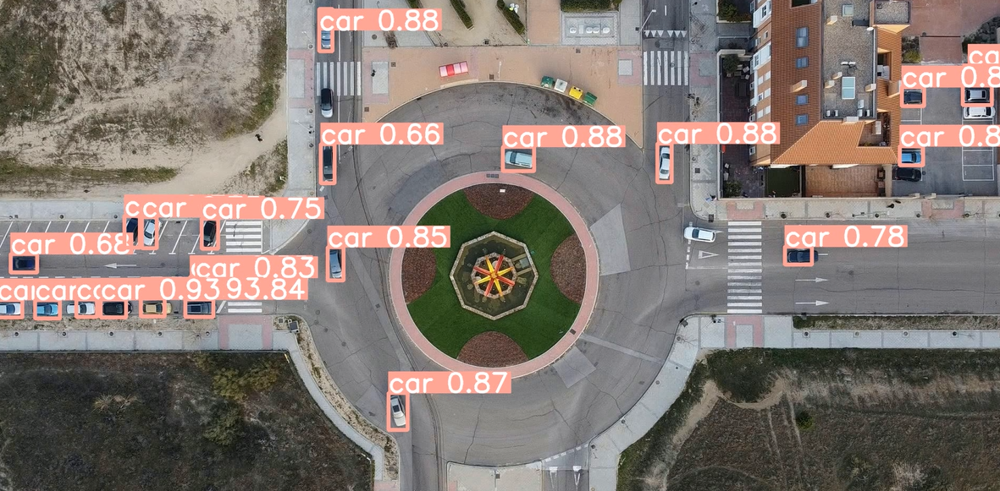
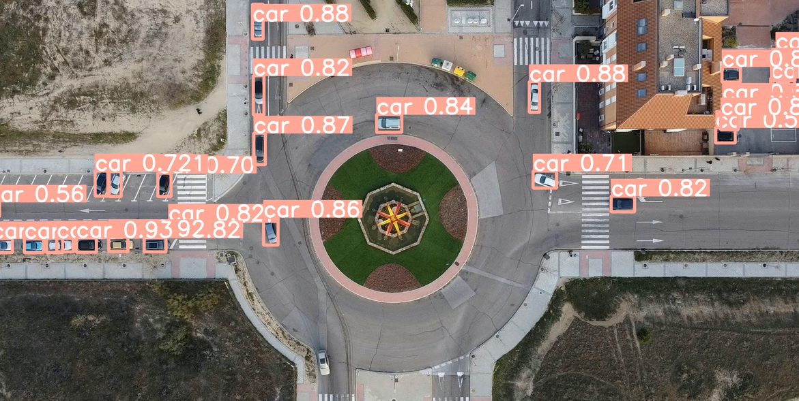

## Overview

This repository contains a study comparing the performance of YOLOv8, YOLOv9, and YOLOv10 on object detection task. The focus is on evaluating the models' performance in terms of accuracy, speed, and model parameters.

## Model Inference Video

<!-- <table>
  <tr align="center">
    <td>
      <strong>yolov8m inference result</strong>
       
      
    </td>
    <td>
      <strong>yolov9c inference result</strong>
       
      
    </td>
    <td>
      <strong>yolov10m inference result</strong>
       
      
    </td>
  </tr>
</table> -->

  <strong>yolov8m inference result</strong>
   
  

  <strong>yolov9c inference result</strong>
   
  

  <strong>yolov10m inference result</strong>
   
  

Yolov8m inference result on another dataset.

<!-- 

 -->
<!--  -->

# Comparison results

To compare these models, I used YOLOv8n and YOLOv8m, YOLOv9c, YOLOv10n, and YOLOv10m. The reason for comparing the medium-sized models is that there is only YOLOv9c pretrained weight available, and the size of this model is similar to the medium-sized YOLOv8 and YOLOv10 models. The table below shows the comparison results.
YOLOv8m mislabeled an object, whereas YOLOv9c correctly labeled it. This is a minor mistake, and with further training, the model will likely improve.
<!-- <table>
  <tr align="center">
    <td>
      <strong>yolov8m detection</strong>
       
      
    </td>
    <td>
      <strong>yolov9c detection</strong>
       
      
    </td>
  </tr>
</table> -->

  <strong>yolov8m detection</strong>
   
  

  <strong>yolov9c detection</strong>
   
  

<!--   -->
YOLOv10m detected the mislabeled object by YOLOv8m, but its confidence score is generally lower compared to YOLOv8m and YOLOv9c.

<!-- here you see v8 is correct and v9 is wrong . because the dataset is imbalanced and small and we have very less truck than car.
  
 -->
<!--  -->
<!-- 

  
  

  
  

 -->

  <strong>yolov8n detected all marked objects correctly</strong>
   
  

  <strong>yolov8m detected all marked objects correctly</strong>
   
  

  <strong>YOLOv9c incorrectly labeled one object but correctly detected two other marked objects</strong>
   
  

  <strong>YOLOv10m failed to detect any of the marked objects</strong>
   
  

<!-- 

 -->
<!-- 
 -->

## Objectives

- Compare the accuracy of YOLOv8, YOLOv9, and YOLOv10.
- Evaluate the inference speed and computational requirements of each model.
- Analyze the models' performance on different types of datasets, with a focus on traffic/vehicle detection.

## Repository Structure

- `data/`: Contains the datasets used for training and evaluation.
- `models/`: Contains model configurations and weights for YOLOv8, YOLOv9, and YOLOv10.
- `scripts/`: Python scripts for training, evaluation, and utility functions.
- `results/`: Stores the results of the comparison study.

## Datasets

For comparison and training, I used two datasets from Kaggle:
- (https://www.kaggle.com/datasets/farzadnekouei/top-view-vehicle-detection-image-dataset)
- (https://www.kaggle.com/datasets/javiersanchezsoriano/roundabout-aerial-images-for-vehicle-detection/code)

### Prerequisites

- Python 3.8 or higher
- PyTorch
- Other dependencies listed in `requirements.txt`